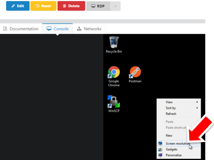
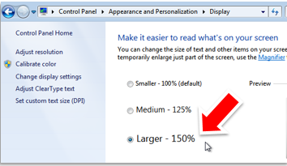
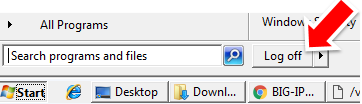

Appendix
========

Changing display for HiRes displays
-----------------------------------

For HiRes Displays (Optional) 
If you find the text hard to read you may opt to change the resolution.  You can either size your laptop display to something like 1920x1080 

OR 
Login via the UDF Portal Console and change the display setting.

Click on *Make text and other items larger or smaller*

Logout the Windows client and reconnect via RDP.

