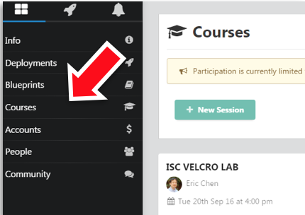
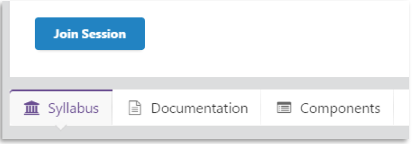
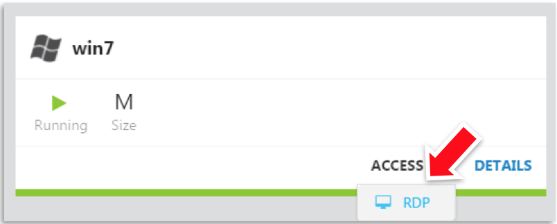

Connecting to UDF
=================

We consider that you have access to UDF for the different labs

Start your environment
----------------------

If you are running this on your own, find the 'F5 CSI Marathon/Mesosâ' blueprint and deploy it.

.. image:: ../images/Blueprint.png
   :scale: 50 %
   :align: center

If this is part of a class find the appropriate class under Courses

and click on 'Join Session'

Access your environment
-----------------------

Once your environment is started, find the 'win7' component under 'Components' and launch RDP (in the ACCESS menu)

Click on the shortcut that got downloaded and it should open your RDP session. The credentials to use are user/user.

*If you have trouble reading the text please see optional directions for changing text size in the Appendix.*

.. warning:: For MAC user, it is recommended to use Microsoft Remote Desktop. It is available in the App store (FREE).
   
   .. image: ../images/icon-RDP.png
   

.. topic:: Change keyboard input

   The default keyboard mapping is set to english. If you need to change it, here is the method:
   * Click on the start menu button and type 'Region' in the search field.
   * Click on 'Region and Language' option in the search list
   .. image:: ../images/select-region-language.png
      :scale: 50 %

   * Select the 'Keyboards and Languages' tab and click on 'Change keyboards'
   .. image:: ../images/select-change-keyboard.png
      :scale: 50 %

   * Add the language you want to have for your keyboard mapping

