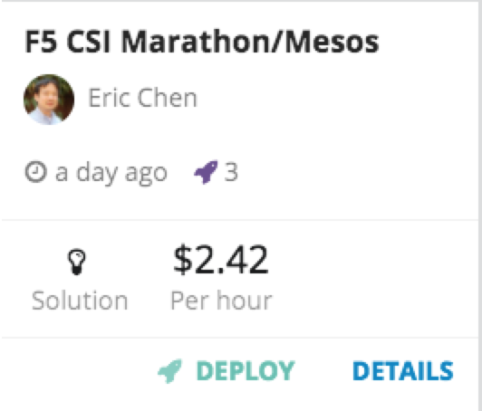
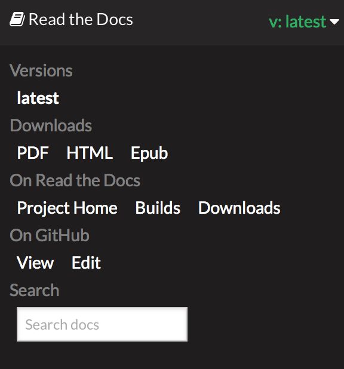

Introduction
============

the following labs are a basic introduction to Docker containers and networking.

To do the labs, we will leverage UDF and the blueprint called 'F5 CSI Marathon/Mesos'.

if you would prefer to have a pdf version of this guide, you may click on **v:latest** at the bottom of the column menu and download a pdf version of this guide

