Lab 1: Run a container 
======================

All commands from this lab will also be provided as a text file.  You may want to download this file first and copy-and-paste the following commands. the commands are in a file on your desktop called *Intro to Docker.sh*. You may edit it by doing a right click on edit and select *Edit with Notepad++*

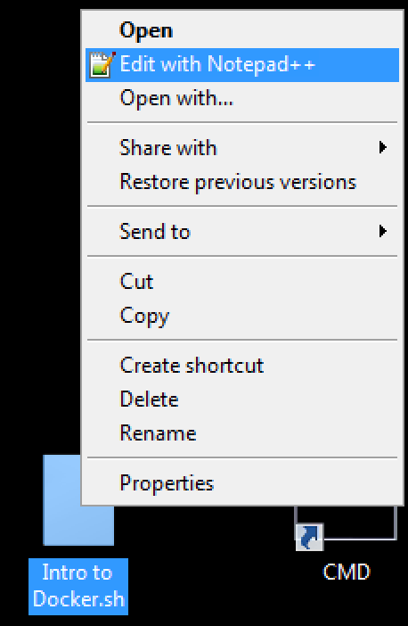

The first lab is an example of migrating an application to run in a container. 

Goals of the lab

1. Learn how to launch an existing container
2. Create your own container
3. Distribute your container 

The legacy Application
----------------------

One of the use-cases for utilizing containers is to migrate an existing on-premises application to first run in a container and eventually migrate the container to run in a public cloud environment.  The first lab will migrate the existing app that is running at: *http://mesos-agent01/*

Launch Chrome and visit **http://mesos-agent01** (make sure to enter *http://*)

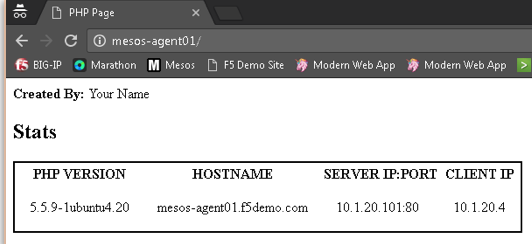

10.1.20.101 is one of agent01 IP addresses. You can check this by typing **ifconfig eth1** in your putty session

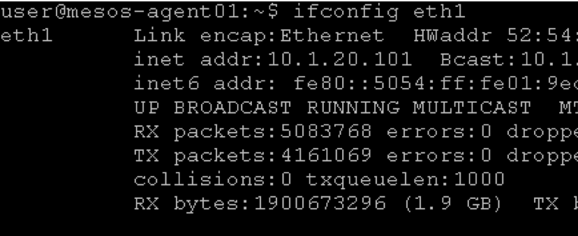

The first step of this lab is to download a container that has a more recent version of PHP.  Note that PHP 5.5 is already an End of Life version of PHP!

Docker Pull
-----------

Normally you would run the command **docker pull [image]:[tag]** to pull down a public image of a container.  This is similar to going to the F5 Downloads site to grab the latest vLab or ISO, but it doesn't require any authentication.  This is an example of a low-friction method of obtaining software that is appealing to Mode 2 users.

The *Docker Hub* (transition to *Store*) has a listing of community images that are available.  Visit **https://hub.docker.com/** and search for *php*.

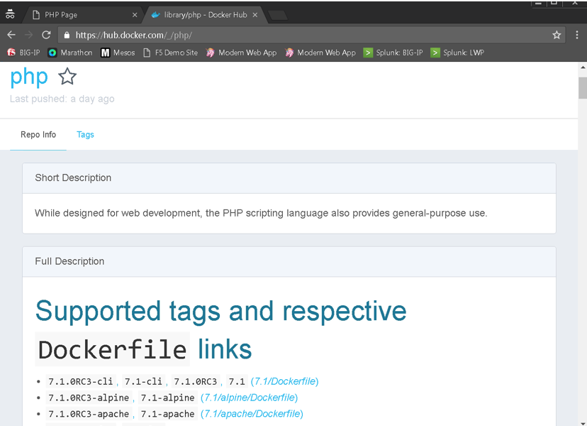

You'll see a long list of available versions of PHP that can be downloaded.

In this lab, we have already downloaded the required containers.  You can view the available containers by running the command::

  docker images

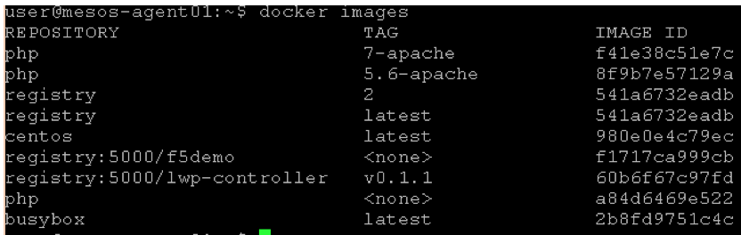

For the lab we have retrieved *php:5.6-apache* and *php:7-apache*.  These represent containers that can run PHP 5.6 / 7 running on the Apache web server (httpd).

.. warning:: 
   For your information, if the user doesn't have the proper privileges, you'll see something like this: 
   
   *Cannot connect to the Docker daemon. Is the docker daemon running on this host?*
   
   In case of this error, you can either run as root or use the sudo command, i.e. **sudo docker images**
   In this lab, it should not be the case.  We have added the user *user*  to the docker unix group to enable it to be able to run these commands as a non-root user.

Docker Run
----------

The community PHP container by default does not have any content.  You can verify this by running::

  docker run -p 8080:80 --name myphp php:5.6-apache

This command will start the PHP 5.6 container.  Some of the options we specified: 

* The '-p 8080:80' indicates that we want to create a port forwarding rule to map the host port '8080' to the container port 80 (more about container networking later in the lab).  
* The '--name myphp' is used to name the container.  This is not required, but will make future steps in the lab easier.

.. warning::
   You will see that you don't get a prompt back. This is expected. We just launched the container in foreground. 

Visit **http://mesos-agent01:8080** in Chrome and you will see the following error page (expected).

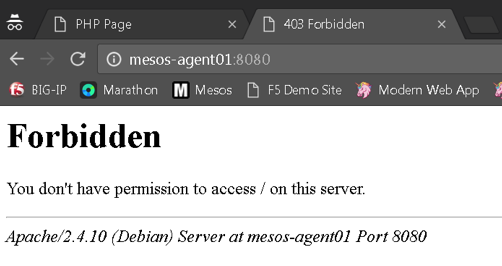

Docker ps / inspect
-------------------

Now that you have a container running you may want to learn some additional docker commands.  

Open a new terminal window on agent01 (leave the existing window open).

.. image:: ../images/agent01-putty-icon.png
      :scale: 50 %
      :align: center

run the following command::

   docker ps

You should see the following: 

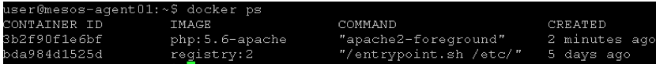

Note there are two containers that are running.  The PHP container that you launched and a *registry* container that will be used later in this lab.

Note the 'Container ID' and 'Ports' columns.  The 'Container ID' represents a unique identifier that you can use to manage individual containers and the 'Ports' columns lists what the current port forwarding mappings are::  

   Highlight the 'Container ID' for the PHP container (this will place the value into your copy and paste buffer - if you double click on the ID, Putty  will automatically highlight it).

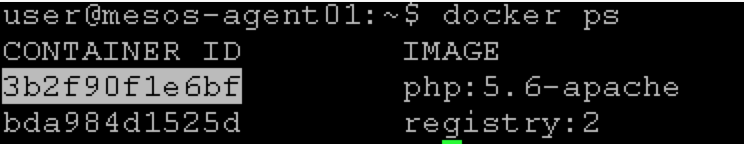

Use this to run the command::

   docker inspect [CONTAINER ID]

or you can simply run::

   docker inspect myphp 

This provides a large amount of detailed data about a container that can be useful if you need to troubleshoot any problems.

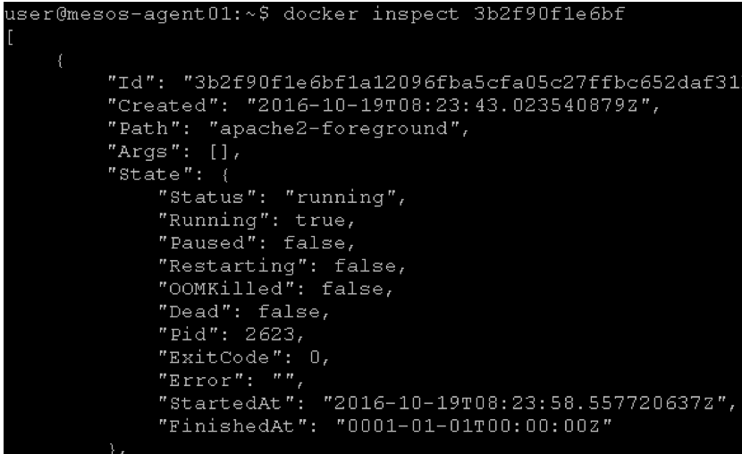

Now run::

   docker logs myphp

This will output the logs from the container (this should match what you see in the other terminal open where we started this container).

Docker stop
-----------

There are two ways that you can stop the container that we started earlier.  Either type **CTRL+C** to terminate the running container (from the window that you originally started it).

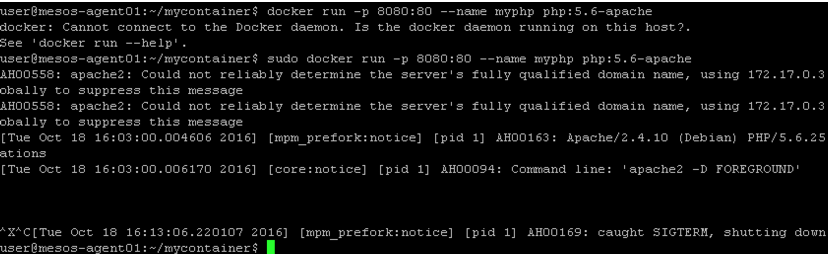

Note that the web server logs are output to the screen (vs. a log file).  

You could also do::

   docker stop myphp

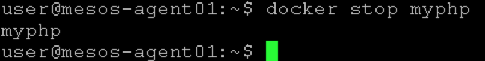

If you run this command, you willl see that we got our prompt back in the other terminal session since we stopped this process. 

If you run::

   docker ps 

you will no longer see *myphp* running. 

Run::
   
   docker ps
   docker ps -a
   docker rm myphp
   docker ps -a

**Docker ps** only shows running containers.  Adding '-a' will show stopped containers and 'rm' will remove a stopped container.

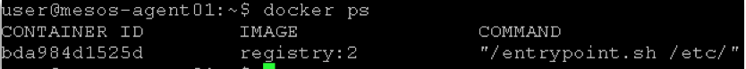

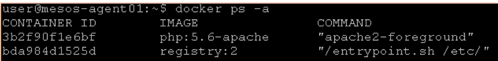

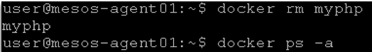

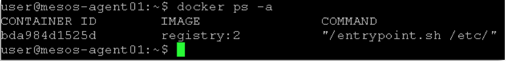

