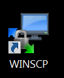
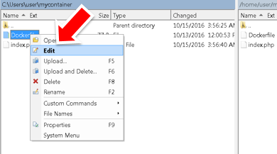
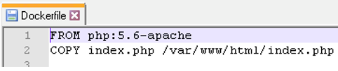
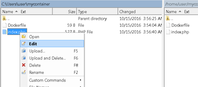
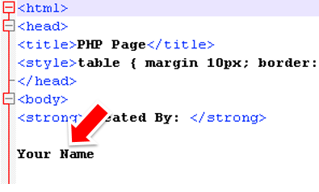
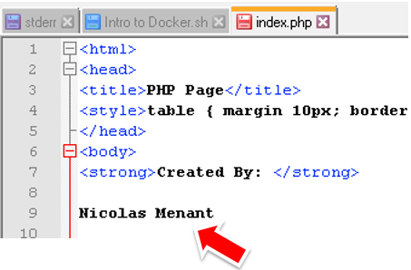
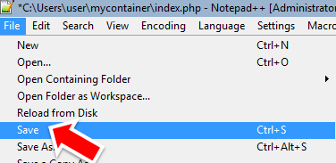
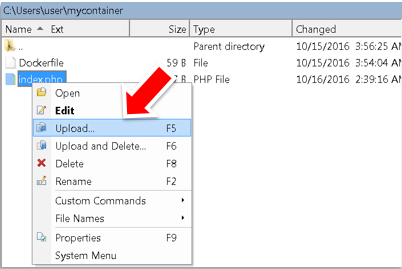
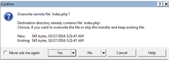

Lab 2: Building a container 
===========================

Setup
-----

Now that we’ve covered the basics of running a container it is time to take a look at building our own custom container.  For this lab we will use WinSCP to transfer files from the Windows client to the Linux host running Docker.

Launch the 'WINSCP' shortcut that is on the Desktop.  Be sure to use this link, it should connect and place you in the Folder 'mycontainer'.

::
   If connection/authentication fails for some reason, here are the relevant information to launch your WinScp session:

   * hostname : 10.1.20.101
   * login: user
   * password: user

   once logged in:
   
      * on mesos-agent01: go to /home/user/mycontainer directory
      * locally: select your c:\Users\user\mycontainer directory

.. image:: ../images/lab2-winscp-connected.png
   :scale: 50 %
   :align: center

First open *Dockerfile* by right-clicking on the filename and selecting *Edit*.

You should see a very simple Dockerfile.  This file is used build a container.  The first line references which container we want to use as the starting container and the second line references the file that we want to copy into the new container.  

Open 'index.php' and change the value of *Your Name* and click on the 'Save' button.

Save your changes and close Notepad++

Now upload your updated 'index.php'. We don’t need to upload the Dockerfile file because we didn’t changed anything.

When prompted, click 'Yes' to overwrite the existing file. 

