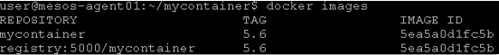
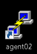
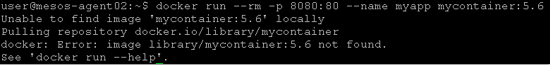
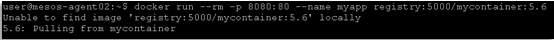
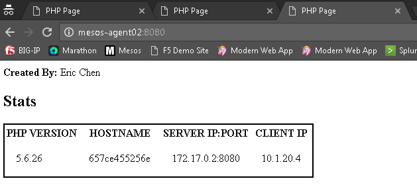

Lab 3: Publishing a container 
=============================

Docker registry
---------------

The container is now running on mesos-agent01, but what if we want to have it run on mesos-agent02? 
It’s possible to manually export/import the image from one host to another, but it’s more practical to use a Docker registry.

A Docker registry is an image repository of Docker containers.  You can “push” a container into the public Docker Hub or maintain your own private Docker registry/repository.
For the lab we have previously created a registry that lives at “registry:5000” (running on mesos-agent01). 

.. note:: 

   We already setup docker to use this registry in the /etc/default/docker file (need to be root to access it)

Docker tag
----------

Currently 'mycontainer:5.6' lives locally on mesos-agent01.  We need to apply a tag that will indicate where we want it to go, then me need to push/copy the image to that location.  

Run

::

   docker tag mycontainer:5.6 registry:5000/mycontainer:5.6
   docker images

.. note:: 

   Note that you have two tags with the same Image ID.  

Now run:

:: 

   docker push registry:5000/mycontainer:5.6 

Open a terminal window to agent02. You have the following shortcut on your desktop, use it. 

Run

::

   docker run --rm -p 8080:80 --name myapp mycontainer:5.6

 
Note that the command failed.  The container does not exist on this host.  Now run.

::

   docker run --rm -p 8080:80 --name myapp registry:5000/mycontainer:5.6

.. note::

   The option '–-rm' specify that the container should be automatically removed with it exits 

 
The container was found on the private registry and was started.  Verify by visiting **http://mesos-agent02:8080** in Chrome.

 
You can now close the agent02 terminal window.  It will not be used for the rest of the lab. 

