Lab 4: Docker Networking 
========================

Ephemeral ports
---------------

Up to this point we have been using a static port mapping of port 8080 on the host to port 80 on a container.  This works OK for a limited use-case, but generally you should not expect a container’s port binding to be static.  

Connect to **mesos-agent01** via putty (use shortcut on Desktop) and run:

::
 
   docker run -d --name myapp2 -p :80 mycontainer:5.6

   docker port myapp2

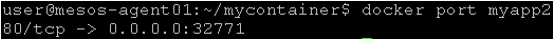

.. note::

   the port option allows you to see the port mappings that was done with the container. 

Record the port value that is returned (your output will differ) and open a new Chrome window for **http://mesos-agent01:[PORT VALUE]**

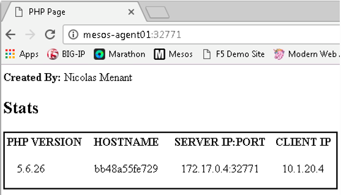

Now run: 

::

   docker restart myapp2

   docker port myapp2

Observe that the port value has changed! 

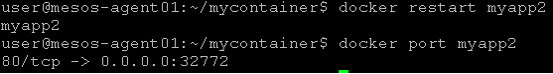

Linux Bridge Network
--------------------

From the previous labs you may have noticed that on both mesos-agent01 and mesos-agent02 the container is running in the 172.17.0.0/16 network.  By default Docker will create a Linux Bridge network on the host called *docker0*.  

Connect via putty to **mesos-agent01** and run:

::

   ifconfig docker0

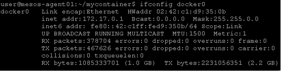

From Chrome visit **http://mesos-agent01:[PORT VALUE]** (port value from last lab step) and record what the Server IP value is. 

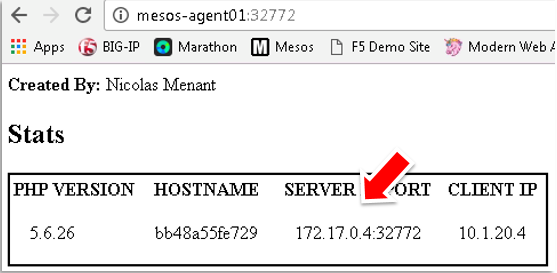

If you remember, agent01 interface eth1 has the IP of 10.1.20.101

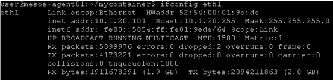

Let’s create a route on our windows client so that all traffic related to the container’s network is sent to our agent01 interface: 

Open a **Windows terminal window** (you have a shortcut on your desktop)

In the windows terminal, run: 

::

   route add 172.17.0.0 mask 255.255.0.0 10.1.20.101

In Chrome open a tab to **http://[server ip]**

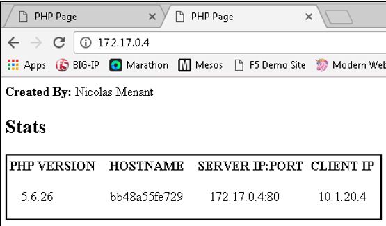

What happened?  On mesos-agent01 IP forwarding is enabled.  When we created a static route from the Windows desktop to the Linux host we are able to forward packets directly to the Linux bridge network and by-pass the IPtables rules that were used previously for port forwarding.

You can check ip forwarding is enabled by running this command on **mesos-agent01**

::

   cat /proc/sys/net/ipv4/ip_forward

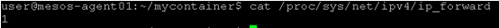

Now run again:

::

   docker restart myapp2

Reload both browser windows.

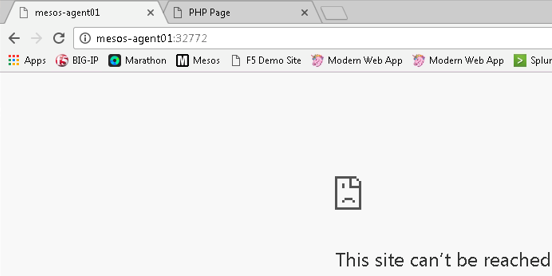

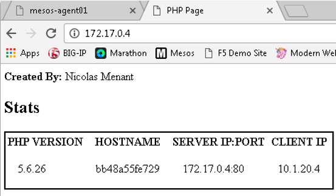

Observe that you can no longer connect to using the previous port value, but can still connect via the linux bridge.

Docker and networking
---------------------

As we have seen in previous lab, the networking setup of our containers are done automatically. 

Docker provides a default network bridge and use it to attach containers to the network. This default network is 172.17.0.0/16 and leverage bridge0 interface. You can create your own bridge / network when needed. 

If you want to review your bridge interface and the containers attached to it, you can do the following on **mesos-agent01**:

::

   docker network ls

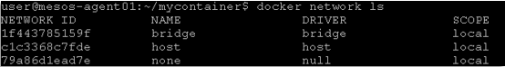

Here you can see the *bridge* network which is what is used by docker container by default.  If you want to run a container in a specific network, you can use the --network option when using **docker run** 

the *none* network adds a container to a container-specific network stack. That containers lacks network interface

The *host* network adds a container on the hosts network stack. You’ll find the network configuration inside the container is identical to the host.

let’s review what has been deployed over the bridge network. Copy the network ID for your bridge (in the previous screenshot, it is 1f443785159f)
 
::

   docker network inspect *[NETWORK ID]*

Here you will see: 

* the network configuration
* IPv4/v6 addresses that have been associated with each container

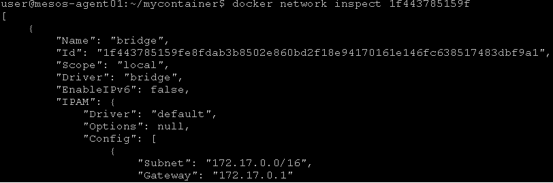

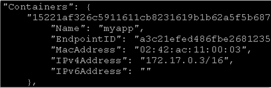

More advanced examples of Docker networking include *Docker Swarm* that utilizes its own SDN to provide multi-host Docker networking.  The Kubernetes project utilizes flanneld for mutli-host Docker networking that can leverage *host-gw* (basic L2/L3), UDP packet encapsulation, or VXLAN.

