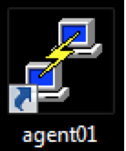

Setting up
==========

There are GUI interfaces to manage a Docker container, but to start we are going to learn about using the command-line interface.  Most users will prefer to use command-line tools.  

Open a session on mesos-agent01. Double click on this icon on your desktop

You should see a large terminal window.  If the Text is too small; please visit the Appendix section at the end of this document on changing the size of the text.

You should be automatically logged in. If not, use the following credentials: 

* Login: user 
* Password: user

.. image: ../images/putty-session-agent01.png
   :scale: 50%
   :align: center

